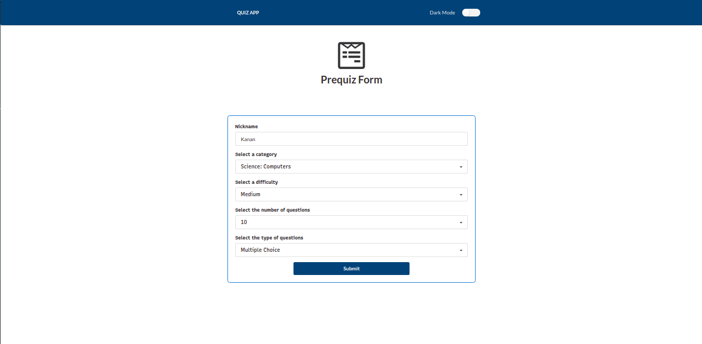
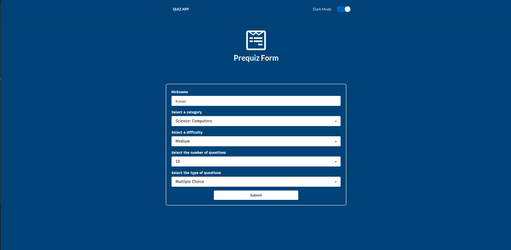
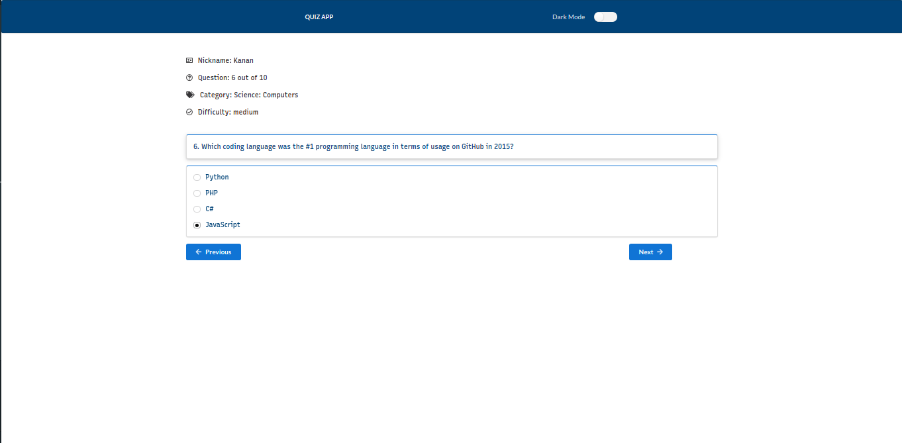
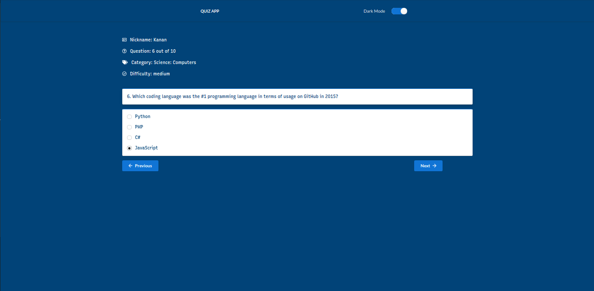
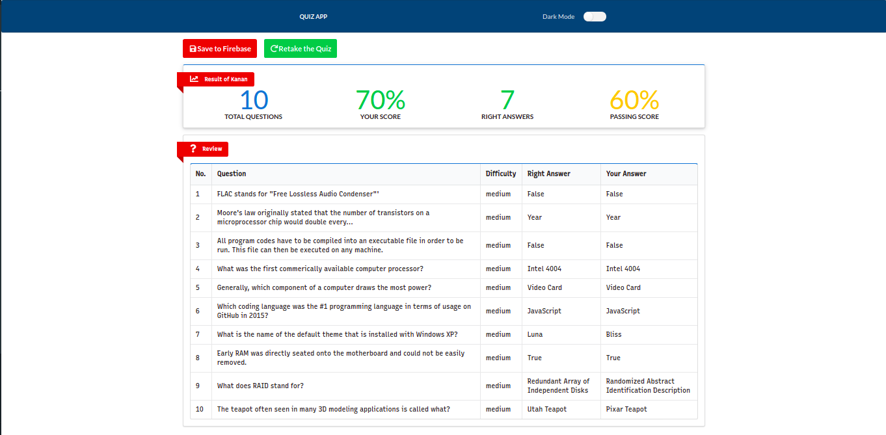
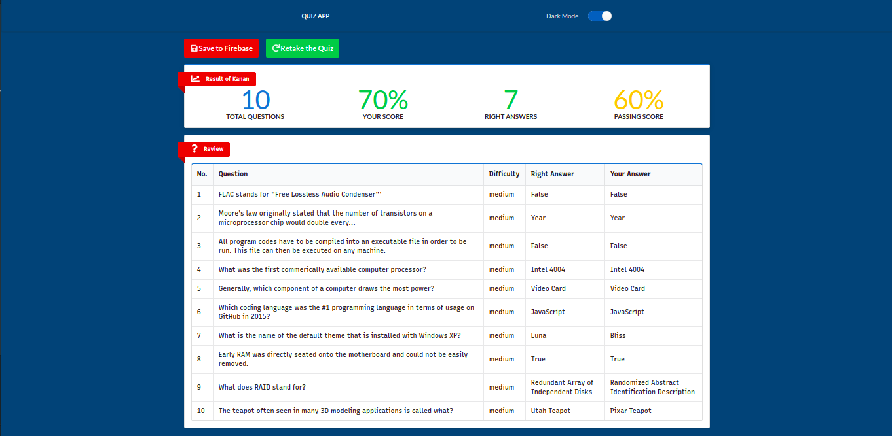

This project was bootstrapped with [Create React App](https://github.com/facebook/create-react-app).

## Available Scripts

In the project directory, you can run:

### `npm start`

Runs the app in the development mode. 
Open [http://localhost:3000](http://localhost:3000) to view it in the browser.

The page will reload if you make edits. 
You will also see any lint errors in the console.

## About This App

Simple quiz app to check your general knowledge about 30+ topics. After choosing the kind of your questions , you can take as much as time you want to solve the questions. Your score will be displayed after all the questions, including the review of the questions. You can save your result to the database or just retake the quiz

## Details of the app
* Dark Theme added
* Database to save your results
* You can choose the difficulty and the category of your questions
* Feel free to use a nickname of your choice rather than random-generated one
* Review the questions after the quiz

## Built With

* [React](https://reactjs.org/) - A JavaScript library
* [Redux](https://redux.js.org/) - State Container for JS Apps
* [Semantic UI React](https://redux.js.org/) - React integration for [Semantic UI](https://semantic-ui.com/)
* [Styled Components](https://styled-components.com/) - CSS for styling React components

## Some Pictures of the app

* 
* 
* 
* 
* 
* 
